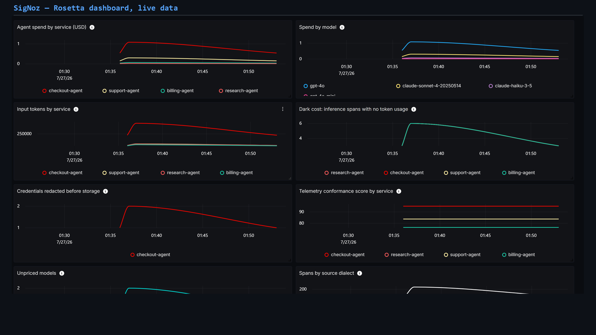
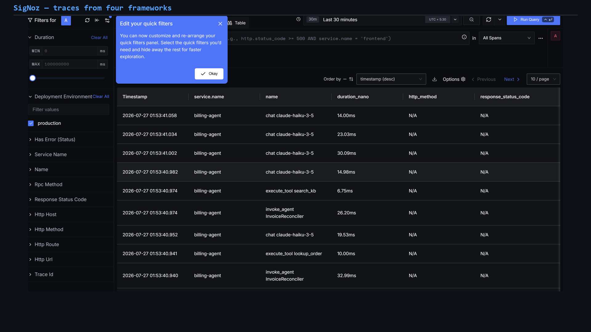
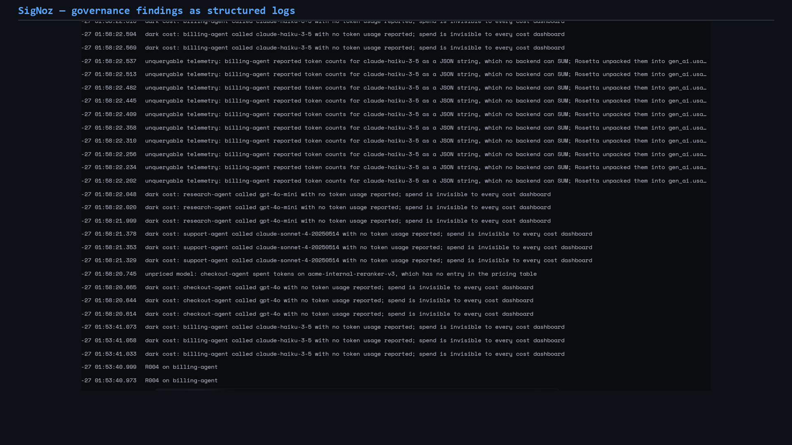
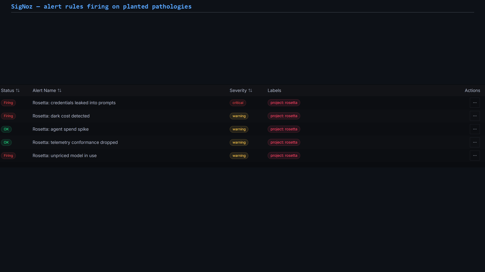

# Why one query could not tell me what four AI agents cost

*Building Rosetta for the Agents of SigNoz hackathon*

I started with a question that should have been boring:

> What did all of my AI agents cost in the last hour?

The test fleet had only four services. Checkout used Pydantic AI, support used
CrewAI/OpenInference, research used LangChain/OpenLLMetry, and billing used the
Langfuse SDK. Every service exported OpenTelemetry data to the same SigNoz
instance. Yet there was no query that could add their input tokens, and none of
the four emitted a common USD cost.

This was not a dashboard problem. The disagreement was already inside the
telemetry.



## The same number, four shapes

The current OpenTelemetry GenAI semantic conventions use
`gen_ai.usage.input_tokens`. Pydantic AI followed that spelling. CrewAI's
OpenInference instrumentation used `llm.token_count.prompt`. LangChain's
OpenLLMetry data used the older `gen_ai.usage.prompt_tokens`. Langfuse placed
usage inside `langfuse.observation.usage_details` as a JSON string.

The last case made the failure unusually clear. The number was visible in the
trace, but a query engine cannot sum a JSON string:

```text
langfuse.observation.usage_details = '{"input": 1668, "output": 407}'
```

There was a second gap: the GenAI semantic conventions describe usage but do
not define a USD cost attribute. Some SDKs calculate cost in their own
namespaces, while others do not calculate it at all.

SigNoz stored each payload faithfully. That is the vendor-neutral behaviour I
wanted, but it also meant I had to solve fragmentation before ingestion rather
than hide it in a backend-specific query.



## The smallest useful architecture

Rosetta is one Python OpenTelemetry `SpanProcessor`, not a new telemetry
backend. Its passes run in a fixed order:

1. **Redact** secrets before another pass can copy them.
2. **Normalise** known framework dialects into canonical additive attributes.
3. **Price** model usage with input, output, cache, and reasoning rates.
4. **Guard** a run by canonical budget, repeated tool calls, or runaway
   context.

The processor never deletes source attributes. Existing framework-specific
dashboards keep working, while new queries can use one vocabulary.

```text
Pydantic AI ─┐
CrewAI       ├─> Python + OpenTelemetry ─OTLP─> SigNoz ─> MCP investigator
LangChain    │      redact / normalise          traces, metrics, logs
Langfuse    ─┘      price / guard               dashboards, alerts
```

Foundry creates the reproducible local deployment: SigNoz, ClickHouse,
PostgreSQL, the OpenTelemetry ingester, and the SigNoz MCP server. The
repository includes both `infra/casting.yaml` and
`infra/casting.yaml.lock`, so a judge can recreate the same stack.

## Why three SigNoz signal types?

I initially considered putting every result on the span. That was simple, but
it confused three different jobs.

A **trace attribute** is ideal for drilling into one request and seeing where
its tokens came from. A **metric** is the right shape for cheap fleet-wide
aggregation and alert thresholds. A **structured log** gives governance
findings their own retention; a credential incident should not disappear
because its trace was sampled or expired.

Rosetta therefore emits all three:

- canonical span attributes such as `rosetta.cost.usd`;
- delta-temporality metrics with controlled service/model dimensions;
- governance logs with finding code, severity, service, trace, and remediation.

That choice let me use SigNoz as more than a trace viewer. I provisioned an
eight-panel dashboard, five alert rules, and a notification channel through its
APIs.



## What the seeded fleet revealed

The demo uses a seeded generator rather than paid model calls. The values and
failure modes reproduce exactly, while the framework attribute shapes are the
real ones.

One run produced 207 GenAI spans and a canonical total of `$0.720353`.
The same query covered all four frameworks:

```text
sum(rosetta.cost.usd) by service.name
checkout-agent  0.479
support-agent   0.196
billing-agent   0.037
research-agent  0.008
```

Normalisation also made less obvious failures queryable:

- 12 inference spans had no token usage in any recognised dialect;
- six types of secret were removed before storage;
- one internal model had usage but no known price;
- a tool was called with the same argument 24 times while its context grew;
- duplicate usage fields exposed a possible double-counting failure.

A dashboard makes those failures visible. Alerts make them operational.



## Closing the loop with a circuit breaker

Observability tells an operator that an agent is burning money. It does not
stop the next turn.

The circuit breaker consumes the already-normalised cost and tool attributes.
That detail matters: a rule written against one vendor's token field would
protect only one service. A rule written after normalisation protects the
entire fleet.

The planted runaway called the same tool with the same argument 24 times. The
breaker opened at turn seven and saved roughly `$0.29` on that single run. It
also emitted its decision back into SigNoz, so enforcement remained observable.

## An agent investigating the agents

The final component reads the telemetry back through SigNoz's MCP server. It
uses the same query tools an operator has, checks cost, dark spans, leaked
secrets, and unpriced models, then writes a Markdown incident report.

The important part is provenance: its verdict comes from the stored telemetry,
not from a second private monitoring database. In the demo the investigator
returns `ACTION REQUIRED` and recommends rotating the exposed credentials.

## Two bugs that changed the implementation

The most useful learning did not come from the happy path.

First, I originally enriched a completed readable span. OpenTelemetry span
attributes are immutable after completion, so counters showed the right totals
while SigNoz received none of the new fields. A unit test would happily verify
the calculation and miss the delivery failure. The fix was to replace the
attribute mapping on the span wholesale, and then to assert on what the
*exporter* received rather than on the processor's own counters.

Second, browser automation appeared flaky because selectors stopped finding
rows. The selectors were fine; the dashboard's "Last 30 minutes" window had
aged past the seeded data while I iterated on the recording. Re-emitting fresh
telemetry before every capture fixed the supposed UI problem.

Both bugs reinforced the same lesson: observability code must be tested at the
backend boundary, not only as pure transformation logic.

## Reproduce it

```bash
cd infra
foundryctl cast -f casting.yaml

cd ..
python scripts/bootstrap.py
python demo/fleet.py
python scripts/provision.py
python scripts/provision_dashboard.py --replace
python scripts/investigate.py --out reports/incident.md
```

The repository also contains 28 focused tests for normalisation, pricing,
redaction, processor delivery, and the runtime guard.

## What I would build next

Rosetta currently runs in-process for Python applications. The natural next
step is an OpenTelemetry Collector processor or an equivalent OTTL pipeline so
non-Python services can use the same rules without embedding the library.

I would not build that before proving the mapping on real production traffic.
Conventions are still moving, and a larger deployment surface would make an
incorrect precedence rule harder to reverse.

The core idea is deliberately smaller: translate once at the telemetry
boundary. SigNoz can then do what it already does well: query traces, aggregate
metrics, retain logs, render dashboards, fire alerts, and expose the same data
to agents over MCP.

Until the ecosystem converges, Rosetta makes the disagreement explicit and
keeps the resulting telemetry portable.

---

### References

- [OpenTelemetry GenAI semantic conventions](https://github.com/open-telemetry/semantic-conventions-genai)
  (moved out of core semconv at v1.42.0; still no tagged release)
- [SigNoz Query Builder](https://signoz.io/docs/userguide/query-builder/)
- [SigNoz dashboards](https://signoz.io/docs/userguide/manage-dashboards-and-panels/)
- [SigNoz alerts](https://signoz.io/docs/alerts-management/overview/)
- [SigNoz MCP server](https://signoz.io/docs/signoz-mcp-server/)

*AI coding assistants were used for research, implementation, testing, video
production, and editing. The submitter directed and reviewed the work and
verified the reported behaviour against the live self-hosted deployment.*
